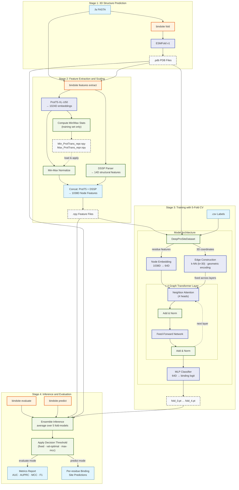

# BindSite Pipeline Architecture (Refined)

A precise technical overview of the BindSite pipeline, detailing data flow from raw sequence to binding site prediction.

## Precision Highlights

### Feature Vector Composition (1038D)
| Source | Dim | Description |
| :--- | :--- | :--- |
| **ProtT5** | 1024 | Transformer-based sequence embeddings, Min-Max normalized. |
| **Dihedral** | 4 | Sine and Cosine of $\phi$ and $\psi$ angles. |
| **Solvent** | 1 | Relative Solvent Accessibility (RSA). |
| **Secondary** | 9 | One-hot encoded SS types (H, B, E, G, I, T, S, -, Unknown). |

### Graph Logic
- **Nodes**: $C\alpha$ atoms representing residues.
- **Edges**: Formed between each node and its **30 nearest spatial neighbors**.
- **Edge Features (16D)**: Encodes relative distances, directions, and orientations between neighboring residues using the local coordinate frames.
- **Augmentation**: During training, random noise (Gaussian) is added to node coordinates to improve model generalization.

### Training Strategy
- **5-Fold Cross-Validation**: The training set is split into 5 folds. Five independent models are trained and saved.
- **Ensemble Inference**: Predictions are generated by averaging the sigmoid outputs of all 5 fold-models, significantly reducing variance.
- **Thresholding**: Unlike standard 0.5 thresholding, the pipeline optimizes the MCC on the validation set to determine the "Val-Optimal" threshold for classification.
